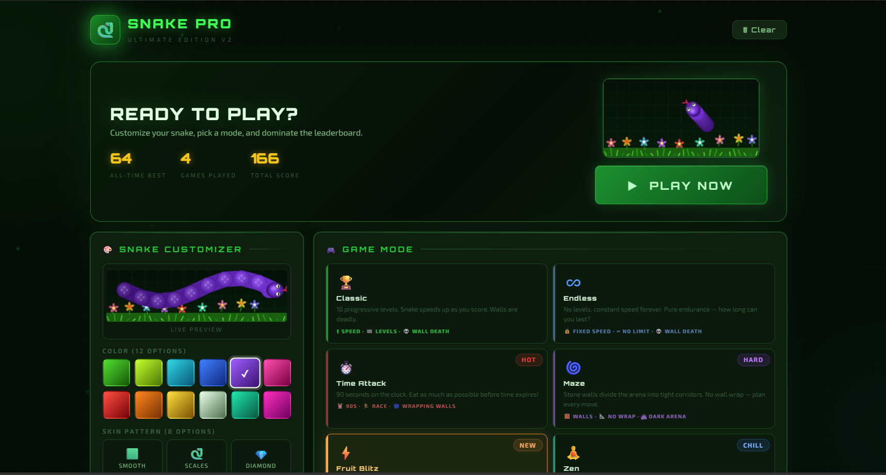
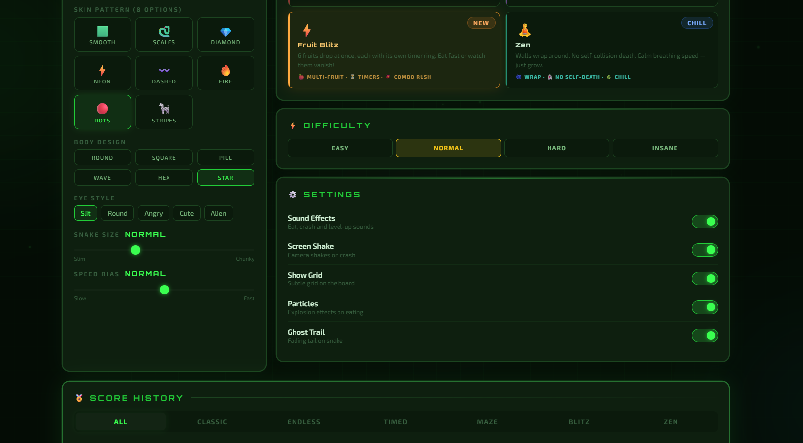
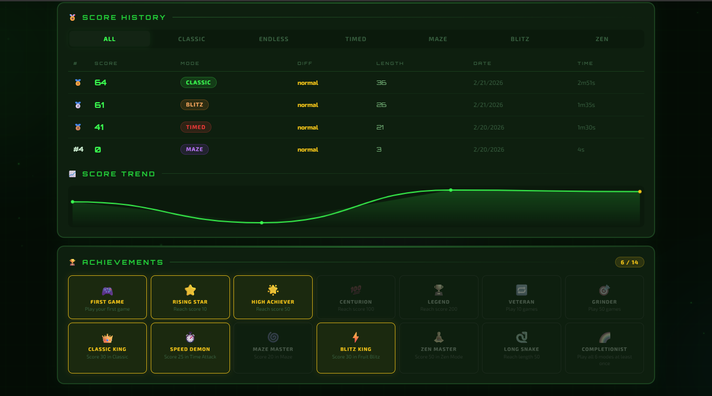
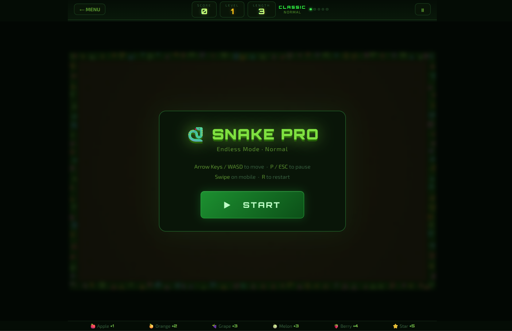
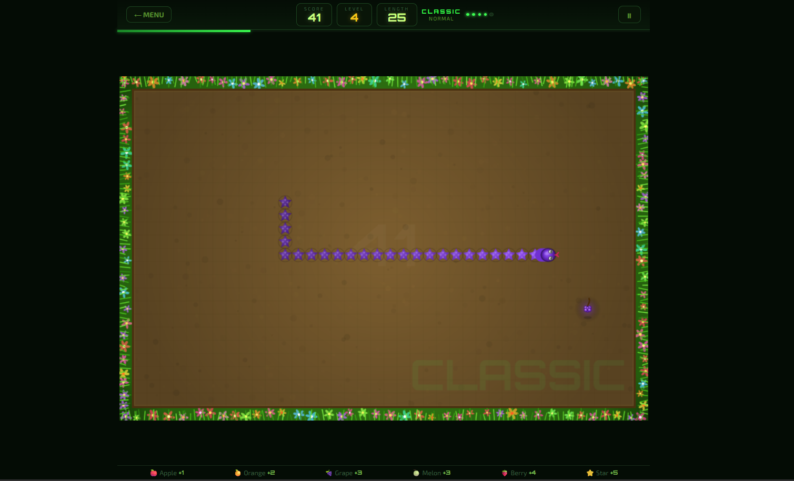
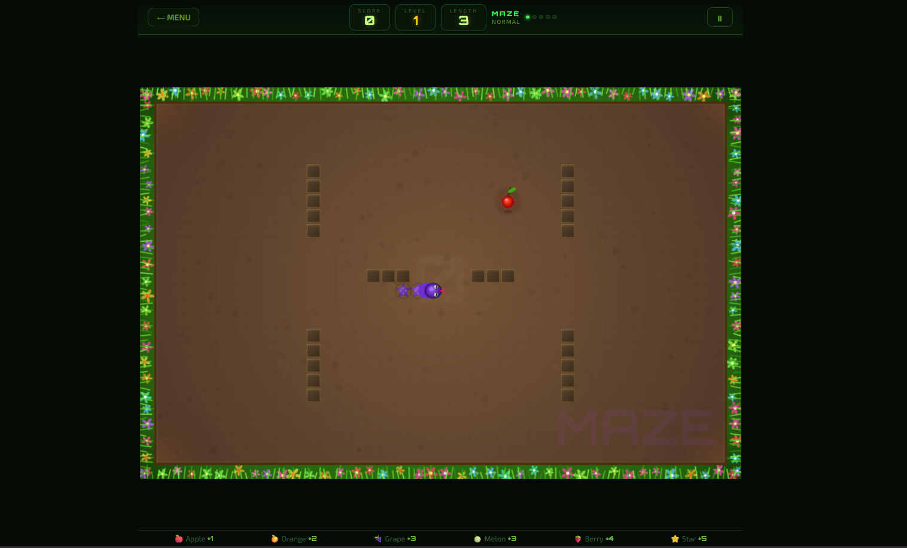
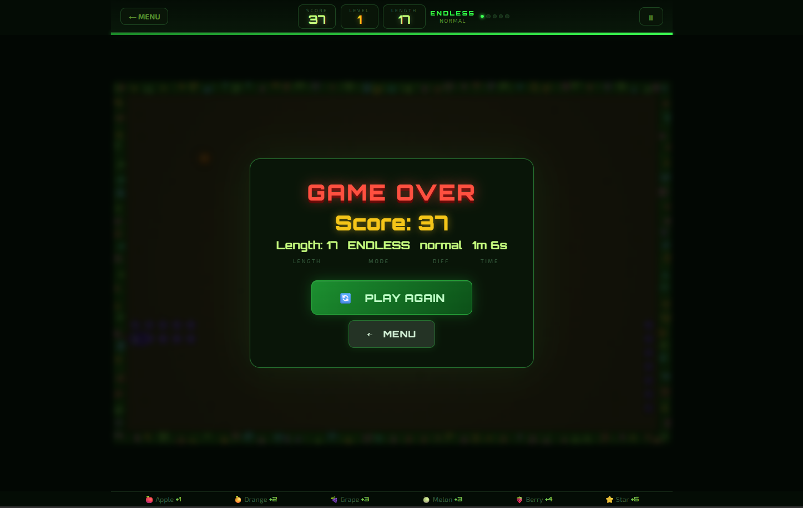

<!-- HEADER BANNER -->
<div align="center">
  
</div>

<br/>

<div align="center">

# 🐍 SnakePro

### *A sleek, modern Snake game — built with pure HTML, CSS & JavaScript*

<br/>

[](https://snakepro-souravbiswas35.vercel.app/)
[](https://github.com/souravbiswas35/SnakePro)
[](https://snakepro-souravbiswas35.vercel.app/)

<br/>


<br/>

> **No frameworks. No dependencies. Just the web — and pure fun.**

</div>

---

## ✨ Overview

**SnakePro** is a polished, browser-based remake of the classic Snake game. Built from scratch using only **HTML5, CSS3, and Vanilla JavaScript** — no external libraries, no build tools, just clean, fast, and fun gameplay that runs anywhere.

Whether you're looking to relive childhood nostalgia or study how games are built without frameworks, SnakePro is a great place to start.
```
⚡ Instant Load  |  🎮 Smooth Gameplay  |  📱 Works on Mobile  |  🎨 Fully Customizable
```

---

## 🚀 Live Demo

<div align="center">

<br/>

### 👇 Click below to play right now in your browser

<br/>

[](https://snakepro-souravbiswas35.vercel.app/)

<br/>

🔗 **URL:** `https://snakepro-souravbiswas35.vercel.app/`

<br/>

</div>

---

## 🎯 Features

| Feature | Description |
|---|---|
| 🐍 **Classic Snake** | Faithful gameplay — move, eat, grow, survive |
| 🏆 **Score Tracking** | Live score counter + high score memory |
| 🎨 **Custom Assets** | Swap snake skin, food images, background |
| 📱 **Responsive Design** | Plays great on desktop, tablet, and mobile |
| ⚡ **Zero Dependencies** | Pure HTML/CSS/JS — no npm, no frameworks |
| 💨 **Fast Loading** | Lightweight files, instant in browser |
| 🌐 **Hosted on Vercel** | Always-on, free, CDN-powered hosting |
| 🔁 **Auto-Deploy** | Push to GitHub → live site updates instantly |

---

## 📸 Screenshots

<br/>

<div align="center">

|  |  |  |
|:---:|:---:|:---:|
| *Main Menu* | *Main Menu* | *🏅 Score History* |

<br/>

|  |  |  |
|:---:|:---:|:---:|
| *Starting Game Screen* | *Continue Game* | *Continue Game* |

<br/>

|  |
|:---:|
| *Game Over Screen* |

</div>

---

## 🕹️ How to Play
```
  ↑
← ● →    Use Arrow Keys to control the snake
  ↓
```

| Control | Action |
|:---:|:---|
| `↑` `↓` `←` `→` | Move the snake |
| Eat 🍎 | Grow longer + gain points |
| Hit wall 💥 | Game over |
| Hit yourself 🐍 | Game over |
| **Goal** | Survive as long as possible & beat your high score! |

> 💡 **Pro tip:** Plan your path ahead — the longer you get, the harder it becomes!

---

## ⚙️ Installation

### 🌐 Option 1 — Play Online (No Setup)

Just open your browser and go:
```
https://snakepro-souravbiswas35.vercel.app/
```

---

### 💻 Option 2 — Run Locally

**Step 1:** Clone the repo
```bash
git clone https://github.com/souravbiswas35/SnakePro.git
```

**Step 2:** Navigate to the folder
```bash
cd SnakePro
```

**Step 3:** Open in browser
```bash
# Option A: Double-click index.html
# Option B: Use VS Code Live Server (recommended)
```

> ✅ No `npm install`. No config. No build step. Just open and play.

---

### ☁️ Option 3 — Deploy Your Own Fork

**Vercel (Recommended):**
1. Fork this repo
2. Visit [vercel.com](https://vercel.com) → `New Project`
3. Import your fork → Click `Deploy`
4. 🎉 Your live URL appears in seconds

**Netlify:**
1. Fork this repo
2. Visit [netlify.com](https://netlify.com) → `New site from Git`
3. Connect repo → Deploy

---

## 🧰 Tech Stack

<div align="center">

| Technology | Role |
|:---:|:---|
|  | Game structure, canvas element, page layout |
|  | UI styling, animations, responsive design |
|  | Game engine, movement logic, scoring |
|  | Version control |
|  | Source hosting + CI trigger |
|  | Live deployment + CDN |

</div>

---

## 📁 Project Structure
```
SnakePro/
│
├── 📄 index.html          →  Entry point (start screen / menu)
├── 🎮 game.html           →  Game canvas and UI
├── 🎨 style.css           →  All styles and animations
├── ⚙️  game.js             →  Snake logic, controls, score
│
└── 🖼️  assets/             →  Visual assets
     ├── image1.png        →  Banner / hero graphic
     ├── image2.png        →  Gameplay screenshot
     ├── image3.png        →  Score panel graphic
     ├── image4.png        →  Movement animation
     ├── image5.png        →  Food item
     ├── image6.png        →  Game over screen
     └── image7.png        →  Asset showcase
```

---

## 🎨 Customization

Want to make SnakePro your own? Here's how:

**🖼️ Change Visuals**
```
Replace files inside /assets/ with your own images.
Supported: .png, .jpg, .gif, .svg
```

**🎨 Restyle the UI**
```css
/* Edit style.css */
:root {
  --snake-color: #22c55e;
  --bg-color: #0f172a;
  --food-color: #ef4444;
}
```

**⚙️ Tweak Gameplay**
```javascript
// Edit game.js
const SNAKE_SPEED    = 150;  // Lower = faster
const GRID_SIZE      = 20;   // Board grid size
const SCORE_PER_FOOD = 10;   // Points per food
```

**📱 Add Mobile Touch Controls**
```javascript
// Add to game.js
document.addEventListener('touchstart', handleSwipe);
```

---

## 👨‍💻 Author

<div align="center">

<br/>

### Built with ❤️ by **Sourav Biswas**

<br/>

[](https://github.com/souravbiswas35)

<br/>

---

**SnakePro** · [Live Demo](https://snakepro-souravbiswas35.vercel.app/) · [GitHub](https://github.com/souravbiswas35/SnakePro) · [Report Bug](https://github.com/souravbiswas35/SnakePro/issues) · [Request Feature](https://github.com/souravbiswas35/SnakePro/issues)

<br/>


</div>
